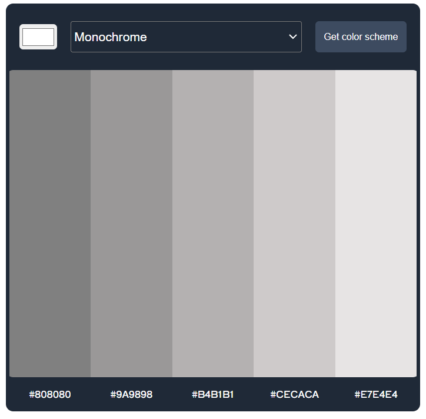
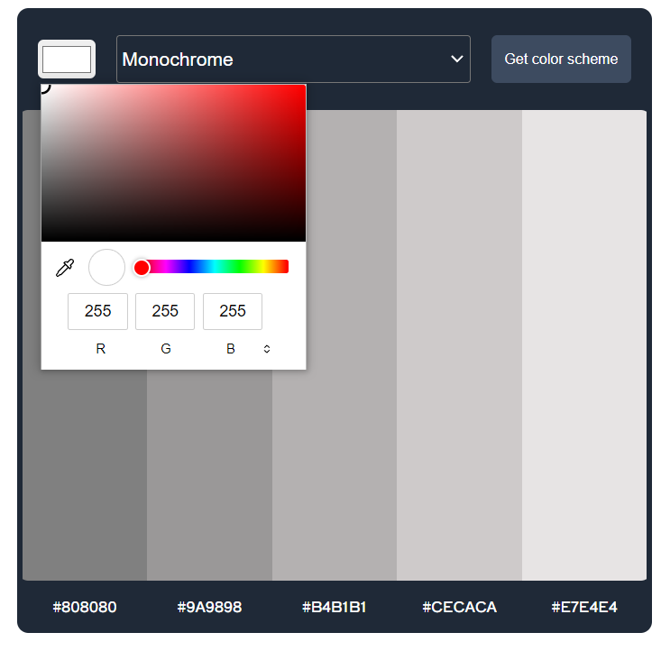
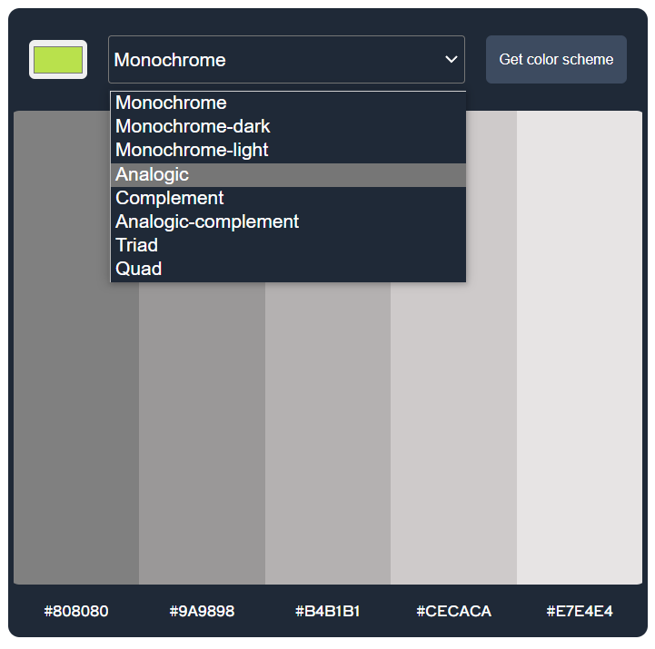
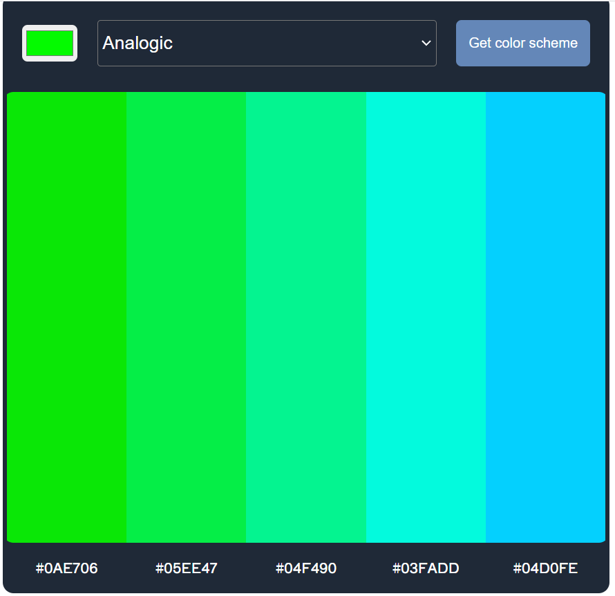
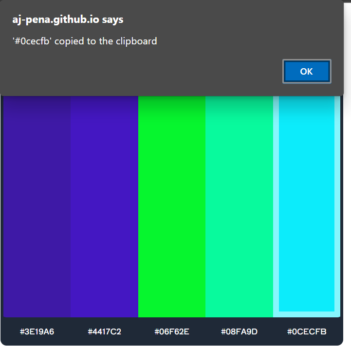

## <Color Theme Generator>

## Table of Contents

  - [Description](#description)
  - [Installation](#installation)
  - [Usage](#usage)
  - [Credits](#credits)
  - [GitHub](#github)
  - [Features](#features)
  
## Description

This application allows the user to generate a scheme of colors based on an initial color seed of choice and a scheme mode. Once the user choices are completed and the 'Get color scheme' button is clicked, the application will perform a fetch request to The Color API and retrieve a collection of 5 colors. Once the color scheme is generated, the user will be able to copy each color's hexadecimal code to the clipboard by clicking on the color strip or the hexadecimal code displayed at the bottom.

## Installation

No installation is needed. This application is run in a live webpage.

## Usage

To use this application, go to the deployed webpage by followig this link: [Visit the deployed page](https://aj-pena.github.io/colorTheme/)

Once in the landing page, click on the color picker at the top left to pick a color seed.

Next, chose a color scheme mode from the dropdown list.

Click on the 'Get color scheme' button to generate the color scheme based on your choice of seed and scheme mode.

Click on the color rectangle or on the hexadecimal code shown below each color strip to copy the hexadecimal code to your clipboard. You are ready now to use it in your code!

## Credits

Third-party assets:
- [Google Fonts](https://fonts.google.com/)
- [The Color API](https://www.thecolorapi.com/) 
- [Scrimba Frontend Developer Career Path](https://scrimba.com/learn/frontend)

Reference material:
- [w3schools](https://www.w3schools.com/)
- [StackOverflow](https://stackoverflow.com/)
- [Mozilla Developer Network](https://developer.mozilla.org/en-US/)

- [CSS-TRICKS guide to flexbox](https://css-tricks.com/snippets/css/a-guide-to-flexbox/)

## GitHub

If you want to know more details, feel free to [visit the repo](https://github.com/aj-pena/colorTheme.git)

## Features

- HTML
- JavaScript:
  - Variables
  - Arrays
  - Objects
  - EventListeners
  - For Of Loops
  - Fetch
  - API
  - Promises
  - Navigator.Clipboard.writeText()
  - Template literals
  

